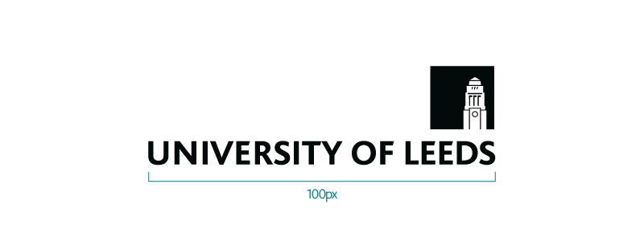

# group-website
Repo for learning how to make websites with GitHub pages

## Contents
* [Learning Markdown](#learning-markdown)
* [Carpentries Lesson programs](#carpentries-lesson-programs)

## Learning Markdown

Vanilla Text contain "italics" and ""bold"".

This paragraph is seperated from the previous one by a blank line.
Line breaks
are caused by two trailing spaces at the end of a line.

[Carpentries website](https://carpentries.org/)

### Carpentries Lesson programs:
1. Softwarew Carpentry
2. Data Carpentry
3. Library Carpentry
    1. Section 1
    2. Section 2

4. Design Library

University of Leeds Logo, copywrite University of Leeds 2022
